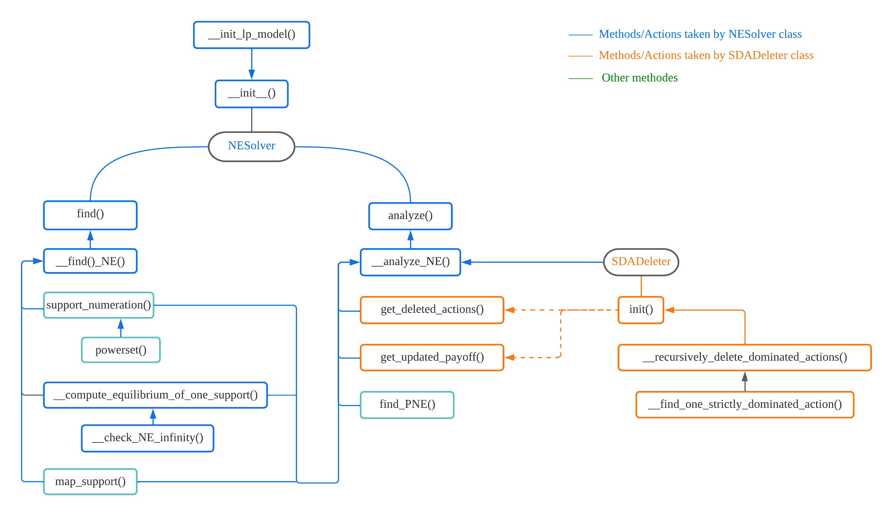

# Introduction

The project computes all pure and mixed Nash Equilibria of a bi-matrix game.

Supported precision :  0.00001

Main steps:

* Delete strictly dominated actions.
* Find all PNE based on column max and row max.
* Do support numeration, and calculate mixed NE based on each support using gurobi.


# File structure

* NESolver
  * NESolver5.py
* SDADeleter
  * SDADeleter1.py
* Test
  * Test3.py


# Software Dependencies

```
python 			3.8.12
gurobipy 		9.5.0
numpy 			1.21.2
pandas			1.3.4
itertools
os
sys
```

# Example Usage

```python
from NESolver.NESolver5 import NESolver
import numpy as np

A = np.array([[8, 2, 2], [3, 9, 3], [-2, -2, 4]])
B = np.array([[1, 2, 4], [-2, 5, 4], [-2, 2, 7]])
n1 = ['I', 'J', 'F']
n2 = ['X','Y','Z']

NESol = NESolver(A=A, B=B, action_name_1=n1, action_name_2=n2)
NESol.analyze()
info = NESol.find()
print(info)
```

## Input

***class NESolver(A, B, action_name_1=None, action_name_2=None)***


* A :  2-d numpy array, payoff matrix of player 1

  B :  2-d numpy array, payoff matrix of player 2
  
  ```python
  A = np.array([[8, 2, 2], [3, 9, 3], [-2, -2, 4]])
  B = np.array([[1, 2, 4], [-2, 5, 4], [-2, 2, 7]])
  ```

* action_name_1 :  list (optional), action names of player1

  action_name_2 :  list (optional), action names of player2

  (Actions will be **indexed from 0** if action_name_1, action_name_2 are None.)
  
  ```python
  n1 = ['I', 'J', 'F']
  n2 = ['X', 'Y', 'Z']
  ```

* A, B should have the same size. The length of a, b should match the shape of A or B.

* Will raise TypeError if input is of wrong datatype :

  ```
  TypeError: The input two payoff matrices should be numpy array.
  TypeError: The input action names should be two list.
  ```

  Will raise ValueError if shapes of inputs do not match :

  ```
  ValueError: The input two payoff matrices should have same size.
  ValueError: The length of input action names should match the number of actions.
  ```

## Output

```python
NESol = NESolver(A=A, B=B, action_name_1=n1, action_name_2=n2)
```

### NESolver.analyze()

```python
NESol.analyze()
```

This method will print out the information of strictly dominated actions(SDA), pure Nash Equilibria(PNE) and mixed Nash Equilibria(MNE) of a given game.

Example output:

```
======= Analyze NE =======
n_SDA:	2
1_SDA:	['I']
2_SDA:	['X']
---------------
n_PNE:	2
PNE:
	(('J',), ('Y',))
	(('F',), ('Z',))
---------------
n_MNE:	1
MNE:
            support  NE_count                                                          NE_value
0  ((J, F), (Y, Z))         1  [(0.000000, 0.833333, 0.166667), (0.000000, 0.083333, 0.916667)]
```

* Strictly dominated actions
  * `n_SDA` :  The total number of strictly dominated actions of the two players.
  * `1_SDA` :  Strictly dominated actions of player 1. (action `I` in this example)
  * `2_SDA` :  Strictly dominated actions of player 2. (action `X` in this example)
* Pure Nash Equilibria
  * `n_PNE` :  Number of pure Nash Equilibria of the given game. (2 PNE in this example)
  * `PNE` :  All pure Nash Equilibria of the given game. ((J, Y) and (F, Z) are the only two PNE in this example)
* Mixed Nash Equilibria
  * `n_MNE` :  Number of mixed Nash Equilibria of the given game. (1 MNE in this example)
  * `MNE` :   All mixed Nash Equilibria of the given game.
    * Index column :  Start from 0.
    * `support` :  Actions with positive possibility. 
    * `NE_count` :  The number of Nash Equilibria based on the support :  `1` or `inf`.
    * `NE_value` :  If `NE_count==1`, it is the value of the MNE. If `NE_count==inf`, it shows an example of the MNE based on the support.						 

### NESolver.find()

```python
info = NESol.find()
print(info)
```

This methods returns a Pandas Dataframe that contains detailed information on calculating the Nash Equilibrium based on each support.

Example output:

```
                   support NE_type  NE_count                                                          NE_value       w1        w2                         x_value  x_count                         y_value  y_count
0             ((I,), (X,))      -1         0                                                              None  8.00000       NaN                            None      0.0  (1.000000, 0.000000, 0.000000)      1.0
1             ((I,), (Y,))      -1         0                                                              None      NaN       NaN                            None      0.0                            None      0.0
2             ((I,), (Z,))      -1         0                                                              None      NaN  4.000000  (1.000000, 0.000000, 0.000000)      1.0                            None      0.0
3           ((I,), (X, Y))      -1         0                                                              None  7.99994       NaN                            None      0.0  (0.999990, 0.000010, 0.000000)      inf
4           ((I,), (X, Z))      -1         0                                                              None  7.99994       NaN                            None      0.0  (0.999990, 0.000000, 0.000010)      inf
5           ((I,), (Y, Z))      -1         0                                                              None      NaN       NaN                            None      0.0                            None      0.0
6        ((I,), (X, Y, Z))      -1         0                                                              None  7.99988       NaN                            None      0.0  (0.999980, 0.000010, 0.000010)      inf
7             ((J,), (X,))      -1         0                                                              None      NaN       NaN                            None      0.0                            None      0.0
8             ((J,), (Y,))     PNE         1  [(0.000000, 1.000000, 0.000000), (0.000000, 1.000000, 0.000000)]  9.00000  5.000000  (0.000000, 1.000000, 0.000000)      1.0  (0.000000, 1.000000, 0.000000)      1.0
9             ((J,), (Z,))      -1         0                                                              None      NaN       NaN                            None      0.0                            None      0.0
10          ((J,), (X, Y))      -1         0                                                              None  8.99994       NaN                            None      0.0  (0.000010, 0.999990, 0.000000)      inf
11          ((J,), (X, Z))      -1         0                                                              None  3.00000       NaN                            None      0.0  (0.166667, 0.000000, 0.833333)      inf
12          ((J,), (Y, Z))      -1         0                                                              None  8.99994       NaN                            None      0.0  (0.000000, 0.999990, 0.000010)      inf
13       ((J,), (X, Y, Z))      -1         0                                                              None  5.49997       NaN                            None      0.0  (0.583328, 0.416662, 0.000010)      inf
14            ((F,), (X,))      -1         0                                                              None      NaN       NaN                            None      0.0                            None      0.0
15            ((F,), (Y,))      -1         0                                                              None      NaN       NaN                            None      0.0                            None      0.0
16            ((F,), (Z,))     PNE         1  [(0.000000, 0.000000, 1.000000), (0.000000, 0.000000, 1.000000)]  4.00000  7.000000  (0.000000, 0.000000, 1.000000)      1.0  (0.000000, 0.000000, 1.000000)      1.0
17          ((F,), (X, Y))      -1         0                                                              None      NaN       NaN                            None      0.0                            None      0.0
18          ((F,), (X, Z))      -1         0                                                              None  3.99994       NaN                            None      0.0  (0.000010, 0.000000, 0.999990)      inf
19          ((F,), (Y, Z))      -1         0                                                              None  3.99994       NaN                            None      0.0  (0.000000, 0.000010, 0.999990)      inf
20       ((F,), (X, Y, Z))      -1         0                                                              None  3.99988       NaN                            None      0.0  (0.000010, 0.000010, 0.999980)      inf
21          ((I, J), (X,))      -1         0                                                              None      NaN       NaN                            None      0.0                            None      0.0
22          ((I, J), (Y,))      -1         0                                                              None      NaN  4.999970  (0.000010, 0.999990, 0.000000)      inf                            None      0.0
23          ((I, J), (Z,))      -1         0                                                              None      NaN  4.000000  (0.999990, 0.000010, 0.000000)      inf                            None      0.0
24        ((I, J), (X, Y))      -1         0                                                              None  5.50000       NaN                            None      0.0  (0.583333, 0.416667, 0.000000)      1.0
25        ((I, J), (X, Z))      -1         0                                                              None  3.00000       NaN                            None      0.0  (0.166667, 0.000000, 0.833333)      1.0
26        ((I, J), (Y, Z))      -1         0                                                              None      NaN  4.000000  (0.333333, 0.666667, 0.000000)      1.0                            None      0.0
27     ((I, J), (X, Y, Z))      -1         0                                                              None  5.49997       NaN                            None      0.0  (0.583328, 0.416662, 0.000010)      inf
28          ((I, F), (X,))      -1         0                                                              None      NaN       NaN                            None      0.0                            None      0.0
29          ((I, F), (Y,))      -1         0                                                              None      NaN       NaN                            None      0.0                            None      0.0
30          ((I, F), (Z,))      -1         0                                                              None      NaN  6.999970  (0.000010, 0.000000, 0.999990)      inf                            None      0.0
31        ((I, F), (X, Y))      -1         0                                                              None      NaN       NaN                            None      0.0                            None      0.0
32        ((I, F), (X, Z))      -1         0                                                              None  3.00000       NaN                            None      0.0  (0.166667, 0.000000, 0.833333)      1.0
33        ((I, F), (Y, Z))      -1         0                                                              None      NaN       NaN                            None      0.0                            None      0.0
34     ((I, F), (X, Y, Z))      -1         0                                                              None      NaN       NaN                            None      0.0                            None      0.0
35          ((J, F), (X,))      -1         0                                                              None      NaN       NaN                            None      0.0                            None      0.0
36          ((J, F), (Y,))      -1         0                                                              None      NaN  4.999970  (0.000000, 0.999990, 0.000010)      inf                            None      0.0
37          ((J, F), (Z,))      -1         0                                                              None      NaN  6.999970  (0.000000, 0.000010, 0.999990)      inf                            None      0.0
38        ((J, F), (X, Y))      -1         0                                                              None      NaN       NaN                            None      0.0                            None      0.0
39        ((J, F), (X, Z))      -1         0                                                              None  3.00000       NaN                            None      0.0  (0.166667, 0.000000, 0.833333)      1.0
40        ((J, F), (Y, Z))     MNE         1  [(0.000000, 0.833333, 0.166667), (0.000000, 0.083333, 0.916667)]  3.50000  4.500000  (0.000000, 0.833333, 0.166667)      1.0  (0.000000, 0.083333, 0.916667)      1.0
41     ((J, F), (X, Y, Z))      -1         0                                                              None  3.49997       NaN                            None      0.0  (0.000010, 0.083328, 0.916662)      inf
42       ((I, J, F), (X,))      -1         0                                                              None      NaN       NaN                            None      0.0                            None      0.0
43       ((I, J, F), (Y,))      -1         0                                                              None      NaN  4.999940  (0.000010, 0.999980, 0.000010)      inf                            None      0.0
44       ((I, J, F), (Z,))      -1         0                                                              None      NaN  4.000030  (0.999980, 0.000010, 0.000010)      inf                            None      0.0
45     ((I, J, F), (X, Y))      -1         0                                                              None      NaN       NaN                            None      0.0                            None      0.0
46     ((I, J, F), (X, Z))      -1         0                                                              None  3.00000       NaN                            None      0.0  (0.166667, 0.000000, 0.833333)      1.0
47     ((I, J, F), (Y, Z))      -1         0                                                              None      NaN  4.499985  (0.000010, 0.833328, 0.166662)      inf                            None      0.0
48  ((I, J, F), (X, Y, Z))      -1         0                                                              None      NaN       NaN                            None      0.0                            None      0.0
```

* Meaning of the columns

  * Index column: Start from 0.

  * `support` :  Actions with positive possibility (done by support numeration).

  * `NE_type` :  The type of the Nash Equilibrium. 3 Possible values :

    * `-1`:  The support does not admit a Nash Equilibrium.
    * `PNE` :  The support admits an pure Nash Equilibrium.
    * `MNE` :   The support admits mixed Nash Equilibria.

  * `NE_count` :  The number of Nash Equilibria supported by the `support`. 3 Possible values :

    * `0` :  The support does not admit a Nash Equilibrium.
    * `1` :  The support admits one Nash Equilibrium.
    * `inf` :  The support admits infinitely many Nash Equilibria.

  * `NE_value` :  Value of the Nash Equilibria. 

    * If `NE_count==0`, it shows `None`.
    * If `NE_count==1`, it is the value of the MNE. 
    * If `NE_count==inf`, it shows an example of the MNE based on the support.

  * `w1` :  Expected payoff of **player 1**. `NaN` if **player 2** fails to have a strategy `y` to form a Nash Equilibrium.

    `w2` :  Expected payoff of **player 2**. `NaN` if **player 1** fails to have a strategy `x` to form a Nash Equilibrium.

  * `x_value` :  A stochastic vector representing (an example of) player1's strategy or `None` if player1 fails to have one.

    `y_value` :  A stochastic vector representing (an example of) player2's strategy or `None`  if player2 fails to have one.

  * `x_count`:  The number of player1's possible strategies :  `0.0`, `1.0` or `inf`

    `y_count`:  The number of player2's possible strategies :  `0.0`, `1.0` or `inf`


## Please see other examples in Test3.py


# Code Structure



* Explanations of each method is within the code comment.

# Time Complexity

**Assumption:** 

* Player**1** is the **row** player having payoff matrix **A** and **n** actions.

  Her strategy is represented as a stochastic vector **x** and her expected payoff is **w1**.  

* Player**2** is the **column** player having payoff matrix **B** and **m** actions.

  Her strategy is represented as a stochastic vector **y** and her expected payoff is **w2**.

## Delete Strictly Dominated Actions (SDA)

Implemented by `__find_one_strictly_dominated_action()` and `__recursively_delete_dominated_actions()`.

**Main Idea:**

* An action is detected as a SDA if in the payoff matrix its column (or row) is strictly smaller than another column (or row) element-wisely.

* `__recursively_delete_dominated_actions()` will check dominated actions for row (with payoff matrix A) and column (with payoff matrix B) players repeatedly.

      (checkA, checkB, checkA… each is called one turn)

* `__find_one_strictly_dominated_action()` will be called to check whether one strictly dominated action exists in one turn. 

     It may be called more than once in one turn if there're multiple SDA in one turn. 

**Principles (priority from high to low):**

* Each player will be checked for at least once
* Stop checking when either player don’t have a dominated action in her turn
* Will change to check another player if no more dominated actions can be found in her turn

### **Worst case time complexity**

Assume player1 has n actions and player2 has m actions. The payoff matrices A and B are of shape n * m. In the worst case, the first turn do not find any strictly dominated actions. Then starting from the second turn, one strictly dominated action is found and deleted at the last comparison in each turn until each player has only one action left. 

| Turn Index | Payoff matrix | Whether SDA exists | Original shape | Outcome shape |
| ---------- | ------------- | ------------------ | -------------- | ------------- |
| 1          | A             | F                  | n * m          | n * m         |
| 2          | B             | T                  | n * m          | n * (m-1)     |
| 3          | A             | T                  | n * (m-1)      | (n-1) * (m-1) |
| ...        | ...           |                    |                |               |
| n+m        | A or B        | T                  | 1 * 2 or 2 * 1 | 1 * 1         |

* To find one SDA in one turn, given payoff matrices of shape i * j

  * Player1 with payoff matrix A: O(j * i * (i-1))
    * Compare the elements between two row: O(j)
    * The number of comparisons: i * (i-1)   (row order matters)
  * Player2 with payoff matrix B: O(i * j * (j-1)) , with similar reasons

* From the aspect of player1, the shape of payoff matrix we need to check:

  * n * m
  * n * (m-1)
  * (n-1) * (m-2)
  * (n-2) * (m-3) 
  * ...

  From the aspect of player2, the shape of payoff matrix we need to check:

  * n * m
  * (n-1) * (m-1)
  * (n-2) * (m-2)
  * ...

* **Assume n = m, the overall time complexity is:**

  $\sum_{k=1}^{n-1} [k(k+1)k+kk(k-1)]+2nn(n-1)$

  $=\sum_{k=1}^{n-1}2k^3 + 2n^2(n-1)$ , (according to $Sn=1^3+2^3+...+n^3=[n(n+1)/2]^2$)

  $= O(n^4)$

* **Since we only consider small games here, let n = 3, the complexity is 54.**

## Find pure Nash Equilibria (PNE)

Implemented by `find_PNE`.

**Main idea:**

* Assume row player1 has payoff matrix A, column player2 has payoff matrix B

* If a strategy profile is detected as PNE if and only if 
  * it's payoff of player1 is the max value in the corresponding column of  A and 
  * the payoff of player2 is the max value in the corresponding row of B.
* Store the location of column max values and row max values into two sets, and find the intersection of the two sets which shows the location of PNE.

### Worst case time complexity

Assume player1 has n actions, player 2 has m actions.

* Find all column max for player1: O(mn)

  * Find the max value of one column: O(n)
  * Number of columns: m

  Find all row max for player2: O(mn)

  * Find the max value of one row: O(m)
  * Number of rows: n

* Assume there are i column max values and j row max values, we use python set `intersection()` to find PNE. The time complexity of this step is O(min(i,j)). (by hash table, Ref: [link](https://stackoverflow.com/questions/8102478/intersection-complexity/8102505))

* Since the upper bound of i or j is mn, the overall time complexity is $O(mn)$ when all strategies have the same payoff for one player.

## Compute Nash Equilibria (NE) based on one support

Implemented by `__init_lp_model()`, `__compute_equilibrium_of_one_support()` and `__check_NE_infinity()`.

**Main idea:**

* We use two LP models to find the NE for each support. One is `lpm_1`, which handles x and w2. One is `lpm_2`, which handles y and w1.
* `__init_lp_model()` builds the two LP with basic variables and constraint that  will be used for each support. Thus it will be called only once. `__compute_equilibrium_of_one_support()` updates the constraints for each support and solve the two LP.
* If an LP model has a feasible solution. We use `__check_NE_infinity()` to find out whether it has infinitely many solutions.

**Steps:** 

* Initialize

  * lpm_1

    |                      |                  |
    | -------------------- | ---------------- |
    | x = [x_1, .., x_n].T | add n variables  |
    | w2                   | add 1 variable   |
    | B*                   | add 1 variable   |
    | x_1,…,x_n >= 0       | add n constraint |
    | x1+x2+..xn=1         | add 1 constraint |
    | B* = B.T  * y        | add n constraint |

  * lpm_2

    |                      |                  |
    | -------------------- | ---------------- |
    | y = [y_1, .., y_m].T | add m variables  |
    | w1                   | add 1 variable   |
    | A*                   | add 1 variable   |
    | y1,…,ym >= 0         | add m constraint |
    | y1+y2+..yn=1         | add 1 constraint |
    | A* = A * y           | add m constraint |

* Update constraints for each support

  * lpm_2

    |                                                              |                   |
    | ------------------------------------------------------------ | ----------------- |
    | y_j  = 0  if action j not in support;  y_j  > 0  if action j in support | add n constraints |
    | A*_j <= w1  if action j not in support; A*_j = w1 if action j in support | add n contraints  |

* Extract

  | w1       | extract 1 value |
  | -------- | --------------- |
  | y1,..,y2 | extract n value |

  


